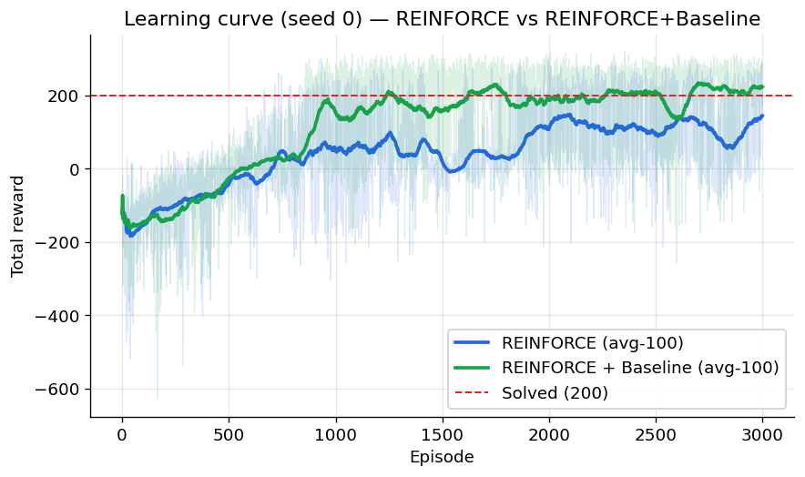

# 🚀 LunarLander — REINFORCE (Policy Gradient)

Triển khai **Exercise 3** (AI VIETNAM — TA Session, slide 68–82): huấn luyện RL agent điều khiển tàu đổ bộ **LunarLander** bằng **Policy Gradient / REINFORCE**, kèm:

- ✨ **Demo Gradio đẹp mắt** với biểu đồ đầy đủ thông tin (learning curve, phân phối reward, so sánh hiệu năng) và xem agent đáp tàu (GIF).
- 🔬 **So sánh REINFORCE thuần (theo slide) với REINFORCE + Baseline** (thêm value head để giảm phương sai gradient → ổn định & hội tụ tốt hơn).
- 📖 Tài liệu giải thích kiến thức + dự án chi tiết: [`docs/EXPLAINER_vi.md`](docs/EXPLAINER_vi.md).

> Slide dùng `gym` + `LunarLander-v2` (đã deprecated). Dự án dùng `gymnasium` + `LunarLander-v3` (giống hệt về state/action/reward), giữ nguyên thuật toán theo slide.

## Cài đặt

```bash
python -m venv .venv && source .venv/bin/activate
pip install -r requirements.txt
```

> `gymnasium[box2d]` cần SWIG + Box2D. Trên Ubuntu nếu lỗi build: `sudo apt-get install -y swig build-essential`.

## Huấn luyện

```bash
python -m src.train --algo reinforce          --episodes 3000 --lr 1e-3
python -m src.train --algo reinforce_baseline --episodes 3000 --lr 1e-3
```

Mỗi lần train lưu `checkpoints/<algo>.pt` và `checkpoints/<algo>_history.json`.

## Chạy demo

```bash
python app.py     # http://localhost:7860
```

**3 tab:**
1. **📊 Tổng quan & So sánh** — learning curve, bar chart hiệu năng cuối, histogram reward đánh giá, độ dài episode, bảng tổng kết.
2. **🎬 Xem agent chơi** — render 1 episode của agent đã train thành GIF.
3. **🧪 Huấn luyện tương tác** — tự chỉnh `episodes / lr / gamma / hidden size` và xem learning curve cập nhật trực tiếp.

## Cấu trúc

```
src/policy.py     # Policy network + PolicyWithValue (value head)
src/reinforce.py  # reinforce() & reinforce_with_baseline()
src/train.py      # CLI train + lưu checkpoint/history
src/evaluate.py   # đánh giá + render GIF
src/plotting.py   # biểu đồ matplotlib
app.py            # Gradio demo
scripts/run_experiment.py       # chạy nhiều seed cho mỗi thuật toán
scripts/finalize_experiment.py  # tổng hợp đa-seed -> checkpoints/experiment.json
scripts/regen_assets.py         # tạo lại plot + GIF trong assets/
docs/EXPLAINER_vi.md  # lý thuyết + giải thích dự án
```

## Kết quả



Vì REINFORCE có **phương sai cao**, mỗi thuật toán được chạy **3 seed** (0,1,2); báo cáo trung bình ± std (đánh giá 50 episode/seed):

| Chỉ số (3 seed) | REINFORCE | REINFORCE + Baseline |
|---|---|---|
| Eval mean ± std | 151.9 ± 35.8 | **177.6 ± 41.5** |
| Eval-std TB mỗi seed (↓ tốt) | 96.8 | **52.2** |
| Best avg-100 ± std | 180.7 ± 30.8 | **197.8 ± 26.3** |
| Số seed solved (≥200) | 1/3 | 1/3 |

**Kết luận:** Baseline cho **reward trung bình cao hơn** và **giảm ~46% phương sai khi đánh giá** (52.2 vs 96.8) — đúng lợi ích lý thuyết của việc trừ baseline. Tái tạo:

```bash
python -m scripts.run_experiment --seeds 0 1 2 --episodes 3000 --lr 1e-3
python -m scripts.finalize_experiment   # -> checkpoints/experiment.json + checkpoint seed 0
python -m scripts.regen_assets          # -> assets/*.png, *.gif
```

## Thuật toán (tóm tắt)

| | REINFORCE | REINFORCE + Baseline |
|---|---|---|
| Gradient | `∇ log π(a\|s)·Gₜ` | `∇ log π(a\|s)·(Gₜ−V(sₜ))` |
| Variance | Cao | Thấp hơn |
| Ổn định | Dễ dao động/phân kỳ | Mượt & ổn định hơn |

Chi tiết: [`docs/EXPLAINER_vi.md`](docs/EXPLAINER_vi.md).
